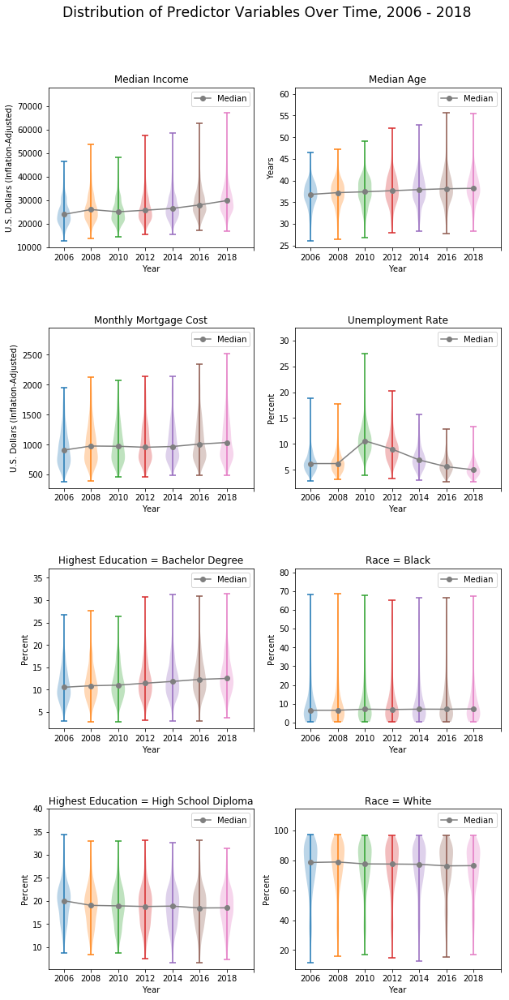
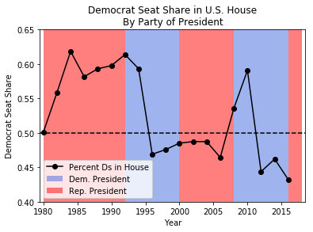
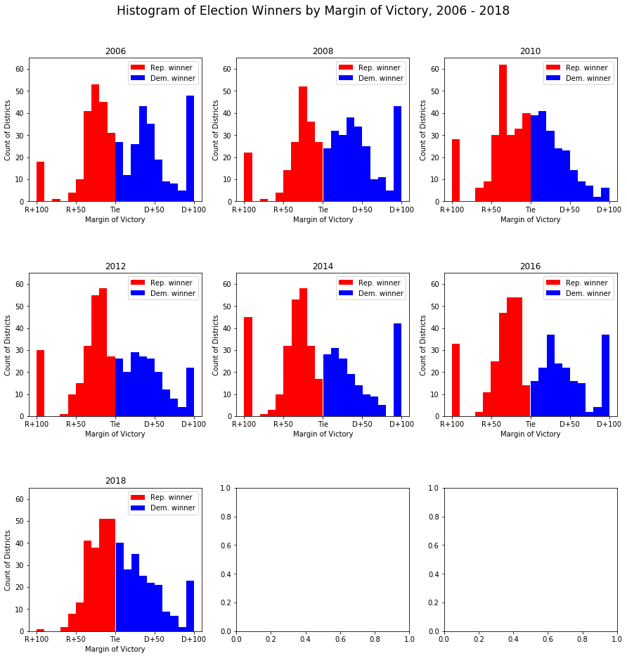
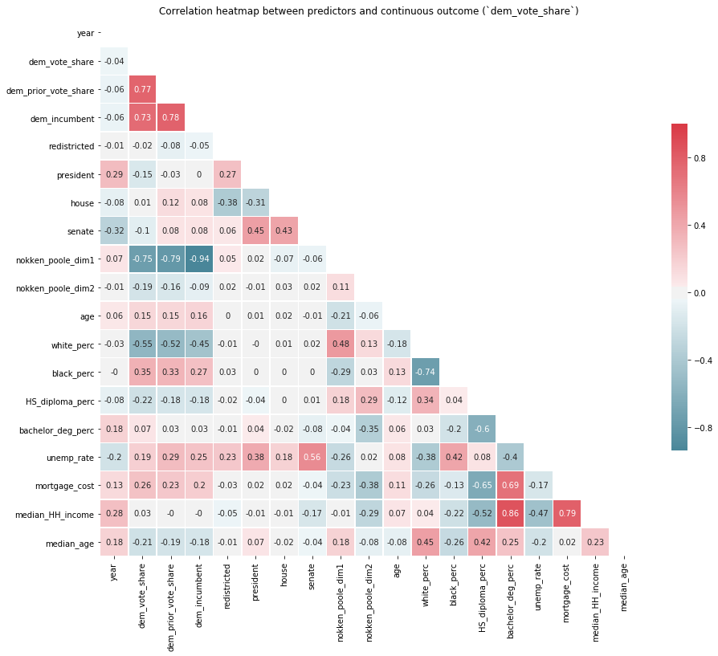



## Description of Data and EDA

Due to the nature of politics, all of our data is observational -- without fortuitous exogenous shocks, there is no way to make causal claims about what social or political factors produce an election outcome. Despite this caveat, we explore the correlations between variables and our outcome, whether, for each district, a Democrat or Republican candidate wins in the 2018 Congressional Election.

## Data Selection and Justification

### Political Outcomes

As our main outcome of interest, we aim to predict which candidate will win the election for each of the 435 races for Congress. Simplifying this, without loss of generality, we model whether the *Democratic* candidate in each district will win; additionally, the two-party nature of politics allows us to operationalize the binary outcome as one where we predict that the Democrat candidate will win the election if her odds of winning are greater than those of the Republican candidate (that is, if the log-odds is greater than zero). In training datasets, if the Democratic proportion of the two-party vote is greater than 0.5, then the Democrat candidate wins.

(Note: There have been a handful of independent members of the House of Representatives of 435 [no more than two per term]. However, as all of the top candidates 2018 election were either Democrats or Republicans, it is safe to ignore third parties/independent candidates in our analysis). 

**Data sources:** 

*2018 election:* At the time of writing, the results of the 2018 Midterm Elections have not yet been published in accessible formats; however, they are available via media outlets online. For this reason, we scraped *Politico*, a trusted online politics website, for the data. Results presented in this project are presented as they stood December 2, 2018, when final scraping was conducted. At this time, in at least two districts, ([North Carolina's Ninth](https://www.nytimes.com/2018/11/30/us/politics/north-carolina-vote-fraud.html) and [California's 21st](https://www.cnn.com/2018/11/28/politics/why-california-is-still-counting-ballots/index.html)), voting irregularities and very close margins mean that these results have not yet been finalized. Whichever candidate was in the lead at this time is recorded as the winner. 

*1980 - 2016 outcomes:* Data collected based on official records by the [Constituency-Level Elections Archive](http://www.electiondataarchive.org/). Following the modeling plan outlined above, we calculated the Democratic share of the two-party vote for each district across 19 elections. 

Code is attached in the accompanying Jupyter Notebook.

### Political Explanatory Variables

**Candidate data**

*Incumbency status:*  [Much research in political science](https://www.jstor.org/stable/2111475) has shown the large positive effect on a candidate's chances of being elected if she is the current holder of the seat (the incumbent). Taking this into account, we create a binary variable for whether the incumbent is running in the election. Next, we combine this binary variable with another that indicates whether the incumbent is a Democrat or Republican, forming an interaction term. When the interaction term indicates that there is a Democratic incumbent running for re-election, we expect predicted Democratic vote share to be higher. When there is a Republican incumbent running for re-election, we expect Democratic vote share to be lower.

*Ideological position(s):* Political scientists have developed techniques to estimate the ideological position of elected representatives, especially those in Congress. [Poole and Rosenthal](https://voteview.com/about) have developed DW-NOMINATE (Dynamic Weighted NOMINAl Three-step Estimation) scores, which are an aggregate measure of a Congressmember's lifetime public voting record in office over two dimensions, which broadly reflect differences in preferences on economic and social policy. We also include the [Nokken-Poole score](https://onlinelibrary.wiley.com/doi/abs/10.3162/036298004X201294), which does not make assumptions about ideological stability in members of Congress over time, allowing for more fluctuations within the same legislator over time. Both measures provide for different understandings of the ideology of the incumbent (essentially, how long a memory constituents have); thus, we include both in our dataset.

**Contextual data**

*District prior vote share:* For each district, we have a long record of voting. It is likely the case that a district's partisanship, as measured by its most recent vote results, predicts the next future results very well. However, politics is cyclical and all data is subject to random variation. Thus, we include results from multiple years prior to 2018 to train the model. A potential issue with this is the changing nature of districts over time due to redrawing of district boundaries (redistricting).

### Socio-economic Data

Here, we utilize data from the [American Community Survey](census.gov) (ACS), which collects demographic and economic information about 1% of the U.S. population each year. This information is also presented at the level of the Congressional district, making our anlaysis more straightforward. Unfortunately, however, the ACS the only started collecting data at this level in 2005, and other public datasets do not present their data at the level of the Congressional district prior to 2005. Moreover, due to the ['creative' drawing](https://en.wikipedia.org/wiki/Gerrymandering_in_the_United_States) of some district boundaries, it is virtually impossible to map county-level variables to Congressional district variables. 

Our variables of interest are as follows:

*Unemployment Rate:* What percent of people *want* a job but do not have one, for each district? Measures economic stagnation/discontent in a district. When unemployment is higher, we expect the majority party to do more poorly in the next election. ([Arzheimer 2009](https://doi.org/10.1111/j.1540-5907.2009.00369.x)).

*Median Household Income, Median Mortgage Cost:* Political scientists have long established the connection between income/wealth and voting (cf. [Evans & Tilley 2012](http://journals.cambridge.org/abstract_S0007123411000202)). Left-wing parties tend to support higher levels of income and wealth redistribution; thus, the poor/less wealthy tend to vote for the parties on the economic left, broadly, and the rich/more wealthy tend to vote for parties on the economic right. Here, median mortgage cost proxies for the median wealth in the district, since many [Americans' most valuable asset is their home](http://www.pewsocialtrends.org/2011/07/26/chapter-5-which-assets-are-most-important/). Thus, we expect districts with higher median incomes and/or higher mortgage costs to favor Republicans over Democrats in elections. 

*Median Age:* We expect that voters become slightly more conservative as they age.

*Percent White, Percent Black:* Race is a very important characteristic in American politics and the Democratic Party is seen as the defender of the interests of racial minorities, while white identity was made salient in the 2016 election by Donald Trump. For these reasons, we expect these variables to have an effect on the election outcome.

*Highest Education, High School Diploma; Highest Education, Bachelor's Degree:* The Democratic Party tends to attract voters with higher levels of education, so we expect `Highest Education, Bachelor's Degree` to correlate with the Democratic vote share in each district. 

Using ACS data starting in 2005, we have 435 districts * 6 elections = 2610 election observations prior to the 2018 election. While this is a sufficiently high number of observations to train basic models on, as models become significantly more complex, we may run into issues with overfitting to the training set. We take care to limit such problems by not using very high degree polynomials and through regularization, discussed below.

None of our data had missing values, though the estimates that the ACS makes are based at least partially on hot-deck imputation of missing values. The ACS describes hot-deck encoding as a method by which "sampled units are ordered by some frame variables and a unit’s missing items are assigned from a unit – usually the nearest unit in the ordered frame list – within the subset of 'donors' defined as units sharing certain geographic, frame, and possibly demographic attributes with the unit to be imputed ([Wright et al. 2015, p.7](https://www.census.gov/content/dam/Census/library/working-papers/2015/acs/2015_Slud_01.pdf)).  

Essentially, the Census Bureau matches missing observations on non-missing observations using observable characteristics present in both respondents, and imputes the missing value probabalistically, given a set of potential matches. It is unclear to what extent this imputation affects our findings, but given that we are only looking at top-level variables within each district, these issues should be minimal.

## Exploratory Data Analysis

### District-level variables

Figure 3

In <a href="#figure3">Figure 3</a>, we see the distribution of district-level variables over time in their original scale. The first aspect to note is the relatively high range of most of the predictors -- while the bulk of districts for each predictor/year are concentrated in one range, there are several important extreme values for each. For example, in the vast majority of districts, the percent of residents who are black lies at about 8%. However, in at least one district, that share is around 69%. These skewed distributions may lead to biased estimates if we use regression.  

The second aspect to notice in the violin plots is the extent to which the distribution changes over time. We notice that some variables, such as ethnic composition, remain fairly steady over time, while others, such as the unemployment rate, are relatively volatile. Prior to the 2010 election, national unemployment was still high in the aftermath of the Great Recession, and surpassed 25% in some heavily-affected districts. 

There are multiple ways to incorporate this information. If, for example, the relevant cause for a person's candidate choice is the *overall* state of the economy, then it might not make sense to create interaction terms between the unemployment rate and year -- 10% unemployment has the same effect on politics whether a country is in recession or not. If, however, there are separate effects of *absolute* economic deprivation (in the form of high district-level unemployment) and also *relative* economic deprivation (unemployment that would be high for normal years, but relatively low when compared to all other districts that year), then we should include interaction terms between unemployment and year. [Ansolabehere et al (2014)](https://onlinelibrary.wiley.com/doi/abs/10.1111/ecpo.12040) suggest that the latter is the case; therefore, we include interaction terms in our model.

### National-level variables

Figure 4

Above, we see the percent seats held by Democrats in the House over time and under Presidents from different parties. This plot shows the midterm advantage enjoyed by the non-presidential party in American politics -- at midterm elections (two years after the President was [re-]elected), voters tend to support the party in opposition. This is seen in the graph above by steep drop-offs in the proportion of House seats held be Democrats 1994-1996 and 2008-2010. Additionally, Republicans lost a large share of seats 1982-1984 and 2006-2008.

In terms of modeling, this suggests that we include a dummy variable indicating whether the election was a Presidential or midterm election, which we do in the models below. Given that the 2018 election is a midterm election under a Republican President, we expect the Democratic Party (the opposition party) to gain seats this election.

In Figure 5 below, we have histograms of district-level election results from 2006 to 2018, categorized between those that a Democrat won and those where the Republican candidate did. The *x*-axis represents the candidate's margin of victory. When the candidate runs unopposed, his or her district will appear at the extremes of the plot,  since, by definition, they won all of the votes in that district. When there are many races that are very close, we see spikes in the histogram around the middle of the *x*-axis. There does not appear to be a clear pattern over time in the closeness of elections -- while there were a very high number of close elections in 2010, in 2016, very few elections were close to being a tie. Instead, it appears that many candidates won competitive races with a comfortable margin of victory (around 10-15 points). 

Moving to 2018, we see a very high number of very close elections. While this may be good for democracy, indicating competitive races, it makes the statistician's job very difficult, since the margin for error decreases significantly. When only 2 points separate the candidates, it becomes much more likely that our models will predict the 'wrong' winner.  

Figure 5

### Summary of EDA

Below, we see a heatmap of correlations between all of the explanatory variables in our model. Interestingly, we only see very high correlations among variables that proxy for social class: education, income, and wealth. If we use regularization in our models, the effect of these correlations will be limited. 

Figure 6

**Time effects**

It is likely that the results of more recent elections predict the 2018 outcome better than do those from earlier years. This might be due to factors such as incumbency, changes in ideology, or changes in racial/ethnic makeup. For this reason, we include an interaction term between the prior vote results and the year in which that result occurred.
