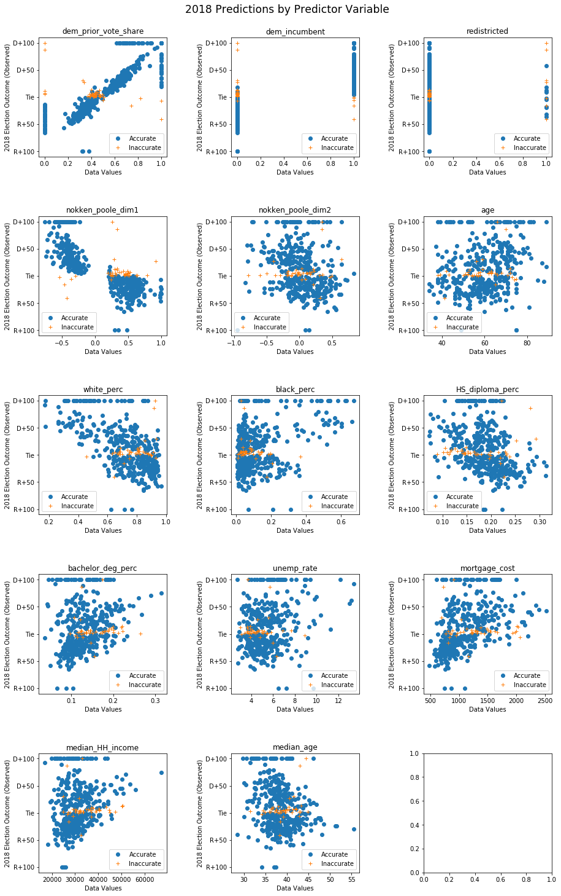



# Results 

## Baseline Model

Our baseline model for predicting the results of the 2018 election is a logistic model predicting whether a Democrat won, using the district's prior election results as the sole predictors. We work under the assumption that we do not know the results of the 2018 election yet, and have to make a predictive model for them. To do this, we git a baseline logistic regression model to the 2016 outcome, based on the district's prior vote share in all of the previous elections for which we have complete data.

Mathematically, this is:

$$
P(D_{win} =1) = (1+e^{-\beta X + c})^{-1}
$$

where $$\beta$$ is composed of the combined results of each election between 2004 and 2014.

Figure 7

Using this simple model, we can predict the 2018 results with 86.9% accuracy.

It is striking to the researchers that even with no additional covariates besides the district's past eight election results, the predictive accuracy of the model is 86.9%. Moreover, this prediction on the test set is over 5 points higher than the training set accuracy, which is 81.57%. It appears that the 2016 election may have been anomalous while 2018 was more of a 'normal' election where traditional predictors were better at predicting the outcome. 

Additionally, we see in <a href="#figure7">Figure 7</a>, that the results are not a simple mapping from prior vote share to predicted vote share -- it does not appear to be true that a district's election result can be assumed to be exactly the same as the past result. Specifically, the model only predicts the Democrat to win the election if the Democrat won the past election by at least ten points (Democrat vote share at least 55%), and predicts the winner to be Republican for the remaining cases. 

Our likely theory for the success of this model is that since prior election results are themselves products of the characteristics of the districts and of the representatives who are elected from them, the effects of many of the other predictors are already present in the prior voting reuslts. 

Figure 8

This effect is shown graphically in <a href="#figure8">Figure 8</a> above for a two-period case. In this example, the result of the election in 2016 is dependent on the racial makeup and voter wealth in that year. Since district wealth and racial makeup of a district are slow to change, these values in 2016 are likely to be very similar to those in 2018. Therefore, the 2016 election results are extremely good predictors for the 2018 results, since the prior results are the products of innumerable district-level variables that help predict the results of elections, regardless of other time-sensitive predictors. 

## Extended Models

### Model selection and implementation

Our goal of predicting the result of the midterm elections is essentially a binary classification problem with two classes (Democrat win = 1 and Republican win = 0). We have a number of choices in terms of which classification model to choose, including linear or quadratic discriminant analysis, k-nearest neighbours, decision trees or logistic regression. Given that are dataset is relatively small with 435 districts and would lead to a reasonable computational time, we decided not to use discriminant analyses.  The benefit of the simplicity of k-nearest neighbours is also limited given the nature of our dataset. Therefore, we decided to use Logistic regression and its variants to model our data. In addition, we explored the performance of decision trees (bagging and random forest) for comparison. 

The performance of the various models in our analysis is summarized in Table 1. The models were all trained on the data from 2005 – 2016 and then used to predict the results for 2018. The model that gave the best predictions is Logistic regression with power and interaction terms. Therefore, the results presented in this report are based on the predictions from this model.

Note in Table 1 that the non-regularized models perform basically just as well as the non-regularized models. This is likely due to the fact that we have relatively few predictors to begin with, and many predictors are not highly correlated with one another (see <a href="data.html#figure6">Figure 6</a>), so dropping variables (LASSO) or reducing the magnitude of coefficients (Ridge) does not seem necessary, especially in the degree-1 models. 

Table 1: Model Performance

|classifier|training accuracy|test accuracy|
|-----|-----|-----|
|Logistic Regression|0.910281|0.896552|
|Logistic Regression with CV (Lasso)|0.896552|0.896552|
|Logistic Regression with CV (Ridge)|0.907971|0.896552|
|Linear Regression (Ridge)|0.914132|0.905747|
|Bagging|0.993454|0.896552|
|Random Forest|0.998845|0.896552|
|Logistic with Power terms and Interactions|0.915671|0.905747|

We further analyze this model below.

Figure 9

To test our model performance, we use the fitted model to predict the 2018 election results, using only data from 2018. Figure 9 above shows the predicted probabilities of the Democratic candidate winning, translated to what his/her expected election margin might be. The *x*-axis for each plot is the value of the untransformed predictor set. 

As we can see, there are only a few cases where 2018 predictor values were especially bad at predicting the outcome, as evidenced by clusters of inaccurate predictions in one region of the graph. We see, for the most part, the model predicted the wrong outcome only in very close races (near ties), where other factors, such as [rain on election day](https://www.journals.uchicago.edu/doi/abs/10.1111/j.1468-2508.2007.00565.x), might have suppressed turnout in an unpredictable way.

One pattern that appears in this analysis is the relationship between economic ideology (`nokken_poole_dim1`) and prediction accuracy. It appears that the model performed especially poorly among moderate to mainstream Republican members of Congress. For districts whose members were between +0.20 and +0.40 (i.e. moderate to mainstream Republicans), the model predicted that they would win, while actually, they lost. This finding supports the observation in the media that the 2018 election would be a "[blue wave](https://www.nytimes.com/interactive/2018/11/07/us/politics/how-democrats-took-the-house.html)" -- many moderate Republicans in the House of Representatives were voted out of office by a mobilization of Democratic voters, especially in suburban areas. 

Crucially, these plots show us the importance of including uncertainty in the model. When we restrict our prediction to those districts whose predicted margin of victory was within 4 percentage points, we improve our model accuracy to 96.12%.

<pre><code>confident_results_indices = [i for i in range(len(ytest.values)) if \
                            np.abs(ytest.values[i]-0.5) >0.04]

accurate_confident_mean = np.mean(y_test_predict_bool[confident_results_indices]\
                               == y_test[confident_results_indices])
 print("Our model confidently predicts the outcome with ",
    np.round(accurate_confident_mean*100,2), "% accuracy.", sep ="")
</code></pre>

Finally, these plots show us the limitations of using only demographic and political information without supplementing it with polling data. These limitations are further discussed in the Conclusions and Summary.

# Conclusions and Summary

In this project, we aimed to predict the results of the U.S. Congressional Elections in 2018.

Our model was over 90 percent accurate in predicting the results of the 2018 midterm elections. Given that the highest accuracy achieved by professional election forecasters is 95 percent, we are relatively happy with the performance of our model. A closer look reveals what may have made a difference in the accuracies of our model as compared to the best available model. We find that one important predictor that was used in their model was the past years' polling data which is not easily available for us to use. 

In our discussion above about the evolution of election forecasting, we emphasized the importance of getting accurate polling data and weighting it to produce a consistent measure of partisanship (and therefore predicted election outcome) across districts. If we had had extensive polling data and the resources to make it usable (538s team of full time staff, for example), it is possible we would have been able to recreate their high levels of accuracy by foreseeing the "blue wave" -- increased enthusiasm among self-identified Democrats. 

Another point to note is that [538 used](https://fivethirtyeight.com/features/how-fivethirtyeights-2018-midterm-forecasts-did/) elastic net regularization which, in essence, is a combination of ridge and lasso regularization methods. We tried each of these regularization methods separately but did not find them to be better than our logistic model. Perhaps with several more significant predictors, we would have seen an improvement over our model using regularization methods.

## Future work 

For future work, it would be interesting to see the effect of adding several more significant predictors to our data set such as past years' polling data. In terms of modeling, depending on size of the data set, we could explore discriminant analyses and elastic net regularization methods.
